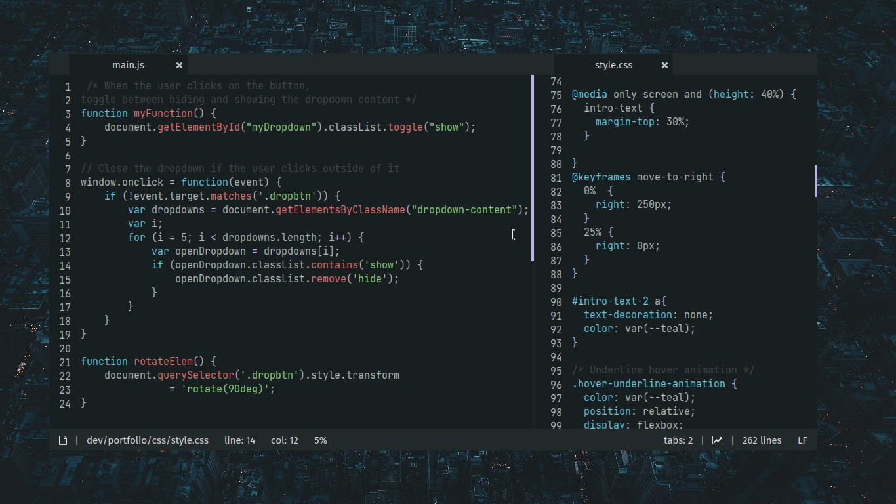

<h2 align="center"> Everblush Lite-XL </h2> 

<p align="center">

</p>


## Preview 


## Installation 
- Install [lite-xl](https://github.com/lite-xl/lite-xl).
- Put ```colors/everblush.lua``` in ```~/.config/lite-xl/colors/```.
- Add the following to ```$HOME/.config/lite-xl/init.lua```.
```sh 
core.reload_module("colors.everblush")
```
